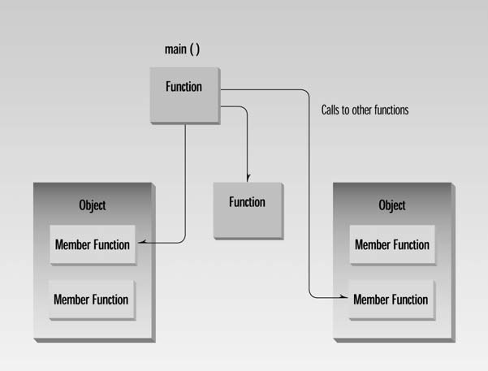

### Basics

For good understanding refer to the file First.cpp and if possible and necessary copy the file and run in on your machine.

## Functions

Functions are one of the fundamental building blocks of C++. The first program in the file First.cpp(refer to the file in this same directory) consists of a function called main(). when you run a C++ program, the first statement executed will be at the beginning of the function main(). The program may consist of many functions and class but on startup, control always goes to the main() function.. if there is no function called main() in your program an error will be reported when you run the program.

## Program Statements
The program statement is the fundamental unit of c++. in our first program First.cpp the line:

 `cout << "Every age has a language of its own;`

and the return statement
    `return 0;`

The first statement tell the computer to display the quoted phrase. Most staetmetns tell the computer to do something. In this aspect, statements in c++ are identical to statements in c

A semicolon signals the end of the statement. If you leave out the semicolon the compiler will always signal an error

The last statement in the function body is return 0;. This tells main() to return the value 0 to whoever called it. in this case the operating system or compiler

## White space

The end of a line is not important to a c++ compiler, actually the compiler ignores whitespace almost completely. White space is defined as spaces, carriage returns, line feeds, tabs, vertical tabs, and formfeeds. These characters are invinsible to the compiler. You can put several statements on one line, separted by any number of spaces or tabs or over two or more lines however such syntax is not recommended since it is hard to read though it does compile correctly

However there are several exceptions to the rule that white space is invisible to the compiler. The first line of the program, starting with #include, is a preprocessor directive ,which must be written on one line. Also, string constraints such as "Every age has a unique languageof its own" (Please refer ) 